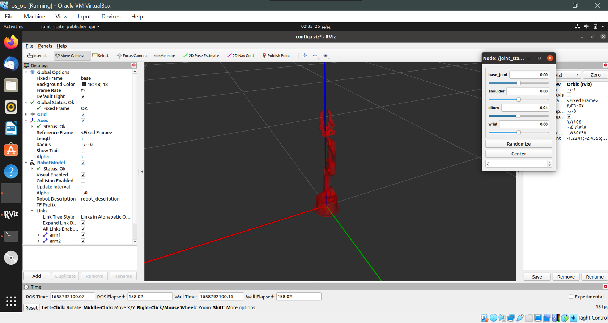
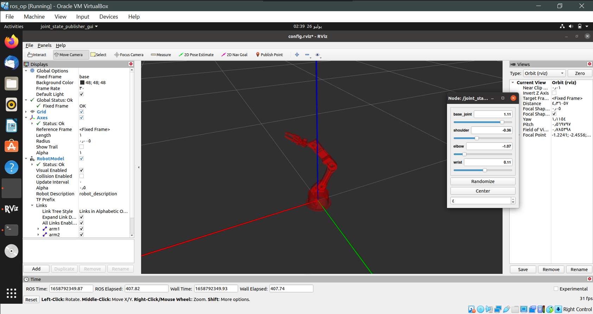

# Robot-arm-Installation
Using ROS packages, you can plan and execute motions for a robot arm in simulation and in reality

I have tested these packages under ROS noetic and Ubuntu 20.04 with no issues

Before you start to install the robotic arm packages, you need to do the following:
* Download and install the latest version of VirtualBox, [Link](https://www.virtualbox.org/wiki/Downloads)
* Download and install an Ubuntu image, [Link](https://ubuntu.com/download/desktop)
* Create your new VM
* Install ROS in ubuntu, by following the instruction in this [website](http://wiki.ros.org/Installation/Ubuntu)

When you finish run the following command to make sure that it has been installed successfully, then press Ctrl+C
```
roscore
```
## Getting started
Update your rosdep
```
rosdep update
```
## Install Prebuilt Package of catkin
```
sudo apt-get install ros-noetic-catkin
```
## Create a ROS Workspace
Create the catkin root and source folders, you can change the name of the workspace used here
```
mkdir -p ~/catkin_ws/src
cd ~/catkin_ws/
```
Configure your catkin workspace
```
catkin_make
cd ~/catkin_ws/src
```
## Install dependencies and launch the project
Clone the robotic arm packages provided from @Smart-methods
```
git clone https://github.com/smart-methods/arduino_robot_arm.git 
```
* Ensure that you have installed all these packages
```
cd ~/catkin_ws
rosdep install --from-paths src --ignore-src -r -y
```
If your using another ROS distro just replace the noetic to the one you are working on
```
sudo apt-get install ros-noetic-moveit
sudo apt-get install ros-noetic-joint-state-publisher ros-noetic-joint-state-publisher-gui
sudo apt-get install ros-noetic-gazebo-ros-control joint-state-publisher
sudo apt-get install ros-noetic-ros-controllers ros-noetic-ros-control
 ```
* Add source (setup.bash) to .bashrc file
```
sudo nano ~/.bashrc
```
Enter your password then add the follwing line at the end of the (bashrc) file and make sure to change the username to your own
```
source /home/arwa/catkin_ws/devel/setup.bash
```
Then press Ctrl+o, Enter, Ctrl+x
* Update your .bashrc file
```
source ~/.bashrc
```
* Finally launch the project
```
roslaunch robot_arm_pkg check_motors.launch
```
## Results
Now you can control the robotic arm on Rviz which is a 3D visualization tool for ROS



